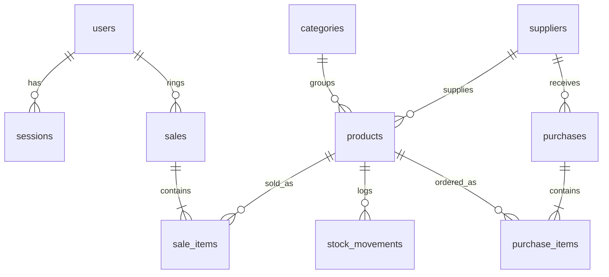

# Database diagram

```mermaid
erDiagram
  users ||--o{ sessions : has
  users ||--o{ sales : rings
  categories ||--o{ products : groups
  suppliers ||--o{ products : supplies
  suppliers ||--o{ purchases : receives
  sales ||--|{ sale_items : contains
  products ||--o{ sale_items : sold_as
  products ||--o{ stock_movements : logs
  purchases ||--|{ purchase_items : contains
  products ||--o{ purchase_items : ordered_as
```
